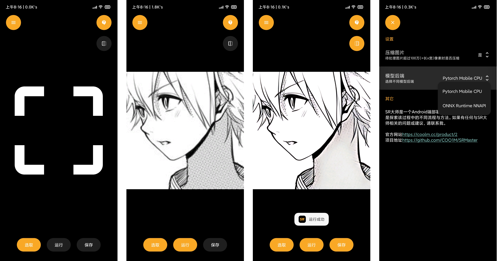
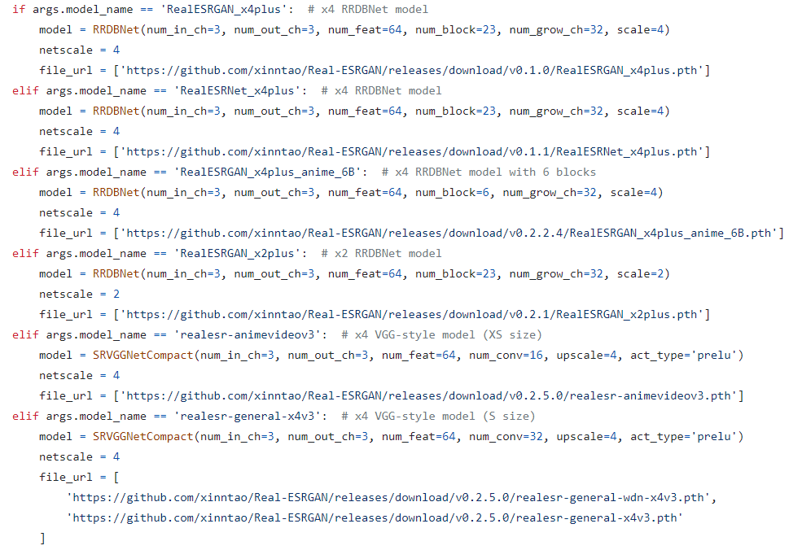
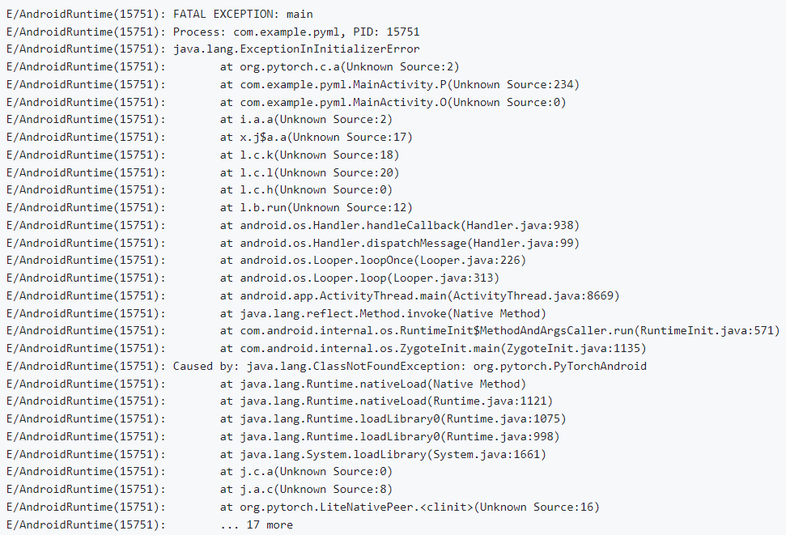
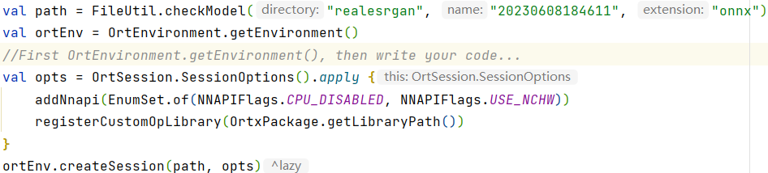
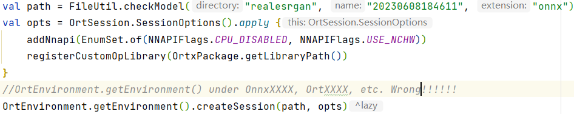
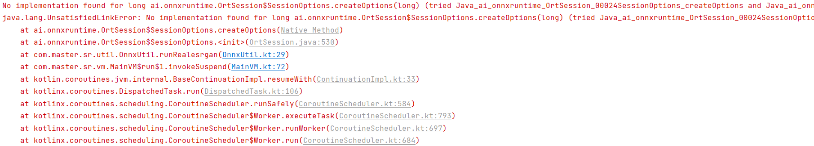

# SR大师

本项目的主要内容是把AI超分辨率模型转化成移动端模型，然后部署到Android端实现本地的图片超分辨率功能，在这个过程中探索出相对简单易用、高效可靠的部署方案，给不精通于Android开发的AI研究人员提供一些参考。

目前，超分辨率模型采用Real-ESRGAN，移动端模型后端已实现Pytorch Mobile、ONNX Runtime。

模型算法请移步 [Real-ESRGAN](https://github.com/xinntao/Real-ESRGAN) ，由于我并非专业AI研究人员，因此只对其模型结构部分有所阅读了解。

模型转换请参考 [Pytorch Mobile](https://pytorch.org/mobile/home/) 文档和 [ONNX Runtime](https://onnxruntime.ai/docs/) 文档，在此不再赘述。

## 软件说明

### 主要功能

**选取：** 选择要增强的图片。建议100万(=长x宽)像素以下的图片，否则默认会先压缩到100万像素以下再增强，可在设置中修改。

**运行：** 开始增强图片。请等待一段时间，速度取决于手机性能和图片复杂度，效果取决于图片细节留存度。

**保存：** 保存增强后的图片。储存在“根目录/Pictures/SRMaster”文件夹。

**菜单：** 设置更改一些选项。左上角的按钮。

**对比：** 切换预览增强前后的图片。右上角第二颗按钮。

### 设备要求

Android 9.0，CPU arm64-v8a(64位)

> 之前是支持Android 5.0，CPU armeabi-v7a(32位)的，但是实际上过于老旧的设备运行计算量如此大的超分辨率模型非常吃力，且统计发现用户中Android 9.0以下的设备非常少，因此不再适配。
>
> 若你有适配需求，可以直接在你的项目中改动minSdk和abiFilters，然后在历史提交中找到FileUtil.kt中对Android 9.0以下图片bitmap读写的代码，使用到你的项目中。

### 功能计划

- 模型管理功能
- NCNN后端

## 技术说明

过程中一些容易出现问题的点在这里进行提醒。

##### 1.Real-ESRGAN的模型结构

有RRDBNet和SRVGGNetCompact两种，请注意对应版本。

##### 2.Pytorch Mobile库的混淆规则

在正式打包APP设置minifyEnabled=true时，请添加 `-keep class org.pytorch.** {*;}` 和 ` -keep class com.facebook.** {*;}` 到proguard-rules.pro，否则R8将会压缩混淆掉库方法，APP运行会报错ClassNotFoundException。

##### 3.ONNX Runtime的OrtEnvironment

在使用ONNX Runtime的库方法时，请一定在之前调用 `OrtEnvironment.getEnvironment()` 初始化，否则调用不了库里的方法，报错UnsatisfiedLinkError。

YES ===>

NO ===>

